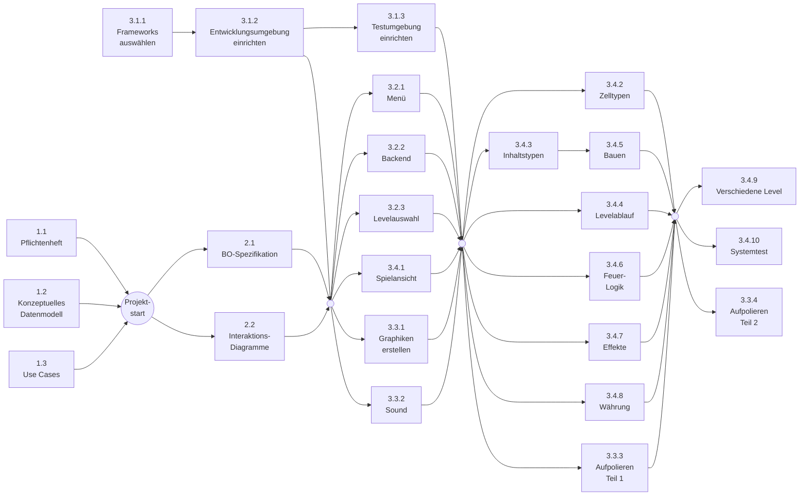

# Netzplan

# Vorgangsknoten

| Nr. 1.1 | **Pflichtenheft** | **Dauer** 1W |
|:---:|:---:|:---:|
|**FAZ** 14.5. | **Gesamtpuffer** 0W | **FEZ** 21.5.|
|**SAZ** 14.5. | **Freier Puffer**  | **SEZ** 21.5.|

| Nr. 1.2 | **Konzeptuelles Datenmodell** | **Dauer** 1W |
|:---:|:---:|:---:|
|**FAZ** 14.5. | **Gesamtpuffer** 0W | **FEZ** 21.5.|
|**SAZ** 14.5. | **Freier Puffer**  | **SEZ** 21.5.|

| Nr. 1.3 | **Use Cases** | **Dauer** 1W |
|:---:|:---:|:---:|
|**FAZ** 14.5. | **Gesamtpuffer** 0W | **FEZ** 21.5.|
|**SAZ** 14.5. | **Freier Puffer**  | **SEZ** 21.5.|

| Nr. 2.1 | **BO-Spezifikation** | **Dauer** 1W |
|:---:|:---:|:---:|
|**FAZ** 21.5. | **Gesamtpuffer** 0W | **FEZ** 28.5.|
|**SAZ** 21.5. | **Freier Puffer**  | **SEZ** 28.5.|

| Nr. 2.2 | **Interaktionsdiagramme erstellen** | **Dauer** 1W |
|:---:|:---:|:---:|
|**FAZ** 21.5. | **Gesamtpuffer** 0W | **FEZ** 28.5.|
|**SAZ** 21.5. | **Freier Puffer**  | **SEZ** 28.5.|

| Nr. 3.1.1 | **Frameworks/Bibiliotheken auswählen** | **Dauer** 1W |
|:---:|:---:|:---:|
|**FAZ** 14.5. | **Gesamtpuffer** 0W | **FEZ** 21.5.|
|**SAZ** 14.5. | **Freier Puffer**  | **SEZ** 21.5.|

| Nr. 3.1.2 | **Entwicklungsumgebung einrichten** | **Dauer** 1W |
|:---:|:---:|:---:|
|**FAZ** 21.5. | **Gesamtpuffer** 0W | **FEZ** 28.5.|
|**SAZ** 21.5. | **Freier Puffer**  | **SEZ** 28.5.|

| Nr. 3.1.3 | **Testumgebung einrichten** | **Dauer** 1W |
|:---:|:---:|:---:|
|**FAZ** 28.5. | **Gesamtpuffer** 1W | **FEZ** 4.6.|
|**SAZ** 4.6. | **Freier Puffer**  | **SEZ** 11.6.|

| Nr. 3.2.1 | **Menü/Startbildschirm erstellen** | **Dauer** 1W |
|:---:|:---:|:---:|
|**FAZ** 28.5. | **Gesamtpuffer** 1W | **FEZ** 4.6.|
|**SAZ** 4.6. | **Freier Puffer**  | **SEZ** 11.6.|

| Nr. 3.2.2 | **Backend zur Spielstand-Speicherung** | **Dauer** 1W |
|:---:|:---:|:---:|
|**FAZ** 28.5. | **Gesamtpuffer** 1W | **FEZ** 4.6.|
|**SAZ** 4.6. | **Freier Puffer**  | **SEZ** 11.6.|

| Nr. 3.2.3 | **Gesamt-Kartenansicht für Levelauswahl** | **Dauer** 2W |
|:---:|:---:|:---:|
|**FAZ** 28.5. | **Gesamtpuffer** 0W | **FEZ** 11.6.|
|**SAZ** 28.5. | **Freier Puffer**  | **SEZ** 11.6.|

| Nr. 3.3.1 | **Graphiken erstellen** | **Dauer** 2W |
|:---:|:---:|:---:|
|**FAZ** 28.5. | **Gesamtpuffer** 0W | **FEZ** 11.6.|
|**SAZ** 28.5. | **Freier Puffer**  | **SEZ** 11.6.|

| Nr. 3.3.2 | **Soundeffekte/Musik auswählen** | **Dauer** 1W |
|:---:|:---:|:---:|
|**FAZ** 28.5. | **Gesamtpuffer** 1W | **FEZ** 4.6.|
|**SAZ** 4.6. | **Freier Puffer**  | **SEZ** 11.6.|

| Nr. 3.3.3 | **Graphik aufpolieren (Teil 1)** | **Dauer** 1W |
|:---:|:---:|:---:|
|**FAZ** 11.6. | **Gesamtpuffer** 1W | **FEZ** 18.6.|
|**SAZ** 18.6. | **Freier Puffer**  | **SEZ** 25.6.|

| Nr. 3.3.4 | **Graphik aufpolieren (Teil 2)** | **Dauer** 1W |
|:---:|:---:|:---:|
|**FAZ** 25.6. | **Gesamtpuffer** 0W | **FEZ** 2.7.|
|**SAZ** 25.6. | **Freier Puffer**  | **SEZ** 2.7.|

| Nr. 3.4.1 | **Spielansicht erstellen** | **Dauer** 2W |
|:---:|:---:|:---:|
|**FAZ** 28.5. | **Gesamtpuffer** 0W | **FEZ** 11.6.|
|**SAZ** 28.5. | **Freier Puffer**  | **SEZ** 11.6.|

| Nr. 3.4.2 | **Zelltypen definieren** | **Dauer** 1W |
|:---:|:---:|:---:|
|**FAZ** 11.6. | **Gesamtpuffer** 1W | **FEZ** 18.6.|
|**SAZ** 18.6. | **Freier Puffer**  | **SEZ** 25.6.|

| Nr. 3.4.3 | **Inhaltstypen definieren** | **Dauer** 1W |
|:---:|:---:|:---:|
|**FAZ** 11.6. | **Gesamtpuffer** 0W | **FEZ** 18.6.|
|**SAZ** 11.6. | **Freier Puffer**  | **SEZ** 18.6.|

| Nr. 3.4.4 | **Levelablauf-Logik** | **Dauer** 2W |
|:---:|:---:|:---:|
|**FAZ** 11.6. | **Gesamtpuffer** 0W | **FEZ** 25.6.|
|**SAZ** 11.6. | **Freier Puffer**  | **SEZ** 25.6.|

| Nr. 3.4.5 | **Bau-Funktionalität** | **Dauer** 1W |
|:---:|:---:|:---:|
|**FAZ** 18.6. | **Gesamtpuffer** 0W | **FEZ** 25.6.|
|**SAZ** 18.6. | **Freier Puffer**  | **SEZ** 25.6.|

| Nr. 3.4.6 | **Feuer-Logik** | **Dauer** 1W |
|:---:|:---:|:---:|
|**FAZ** 11.6. | **Gesamtpuffer** 1W | **FEZ** 18.6.|
|**SAZ** 18.6. | **Freier Puffer**  | **SEZ** 25.6.|

| Nr. 3.4.7 | **Effekte** | **Dauer** 1W |
|:---:|:---:|:---:|
|**FAZ** 11.6. | **Gesamtpuffer** 1W | **FEZ** 18.6.|
|**SAZ** 18.6. | **Freier Puffer**  | **SEZ** 25.6.|

| Nr. 3.4.8 | **Währung** | **Dauer** 1W |
|:---:|:---:|:---:|
|**FAZ** 11.6. | **Gesamtpuffer** 1W | **FEZ** 18.6.|
|**SAZ** 18.6. | **Freier Puffer**  | **SEZ** 25.6.|

| Nr. 3.4.9 | **Verschiedene Level** | **Dauer** 1W |
|:---:|:---:|:---:|
|**FAZ** 25.6. | **Gesamtpuffer** 0W | **FEZ** 2.7.|
|**SAZ** 25.6. | **Freier Puffer**  | **SEZ** 2.7.|

| Nr. 3.4.10 | **Systemtest** | **Dauer** 1W |
|:---:|:---:|:---:|
|**FAZ** 25.6. | **Gesamtpuffer** 0W | **FEZ** 2.7.|
|**SAZ** 25.6. | **Freier Puffer**  | **SEZ** 2.7.|

