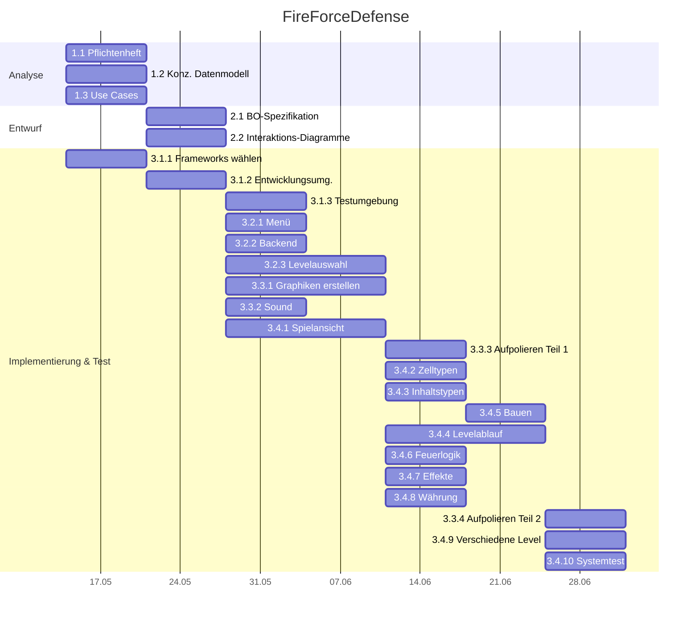

```mermaid
gantt
	title FireForceDefense
	dateFormat YYYY-MM-DD
        axisFormat %d.%m

	section Analyse
        1.1 Pflichtenheft : 1-1, 2020-05-14, 7d
        1.2 Konz. Datenmodell : 1-2, 2020-05-14, 7d
        1.3 Use Cases : 1-3, 2020-05-14, 7d

        section Entwurf
        2.1 BO-Spezifikation : 2-1, after 1-1 1-2 1-3, 7d
        2.2 Interaktions-Diagramme : 2-2, after 1-1 1-2 1-3, 7d

        section Implementierung & Test
        3.1.1 Frameworks wählen : 3-1-1, 2020-05-14, 7d
        3.1.2 Entwicklungsumg. : 3-1-2, after 3-1-1, 7d
        3.1.3 Testumgebung : 3-1-3, after 3-1-2, 7d
        3.2.1 Menü : 3-2-1, after 2-1 2-2 3-1-2, 7d
        3.2.2 Backend : 3-2-2, after 2-1 2-2 3-1-2, 7d
        3.2.3 Levelauswahl : 3-2-3, after 2-1 2-2 3-1-2, 14d
        3.3.1 Graphiken erstellen : 3-3-1, after 2-1 2-2 3-1-2, 14d
        3.3.2 Sound : 3-3-2, after 2-1 2-2 3-1-2, 7d
        3.4.1 Spielansicht : 3-4-1, after 2-1 2-2 3-1-2, 14d
        3.3.3 Aufpolieren Teil 1 : 3-3-3, after 3-2-1 3-2-2 3-2-3 3-4-1 3-3-1 3-3-2, 7d
        3.4.2 Zelltypen : 3-4-2, after 3-2-1 3-2-2 3-2-3 3-4-1 3-3-1 3-3-2, 7d
        3.4.3 Inhaltstypen : 3-4-3, after 3-2-1 3-2-2 3-2-3 3-4-1 3-3-1 3-3-2, 7d
        3.4.5 Bauen : 3-4-5, after 3-4-3, 7d
        3.4.4 Levelablauf : 3-4-4, after 3-2-1 3-2-2 3-2-3 3-4-1 3-3-1 3-3-2, 14d
        3.4.6 Feuerlogik : 3-4-6, after 3-2-1 3-2-2 3-2-3 3-4-1 3-3-1 3-3-2, 7d
        3.4.7 Effekte : 3-4-7, after 3-2-1 3-2-2 3-2-3 3-4-1 3-3-1 3-3-2, 7d
        3.4.8 Währung : 3-4-8, after 3-2-1 3-2-2 3-2-3 3-4-1 3-3-1 3-3-2, 7d
        3.3.4 Aufpolieren Teil 2 : 3-3-4, after 3-4-2 3-4-4 3-4-5 3-4-6 3-4-7 3-4-8 3-3-3, 7d
        3.4.9 Verschiedene Level : 3-4-9, after 3-4-2 3-4-4 3-4-5 3-4-6 3-4-7 3-4-8 3-3-3, 7d
        3.4.10 Systemtest : 3-4-10, after 3-4-2 3-4-4 3-4-5 3-4-6 3-4-7 3-4-8 3-3-3, 7d

```
