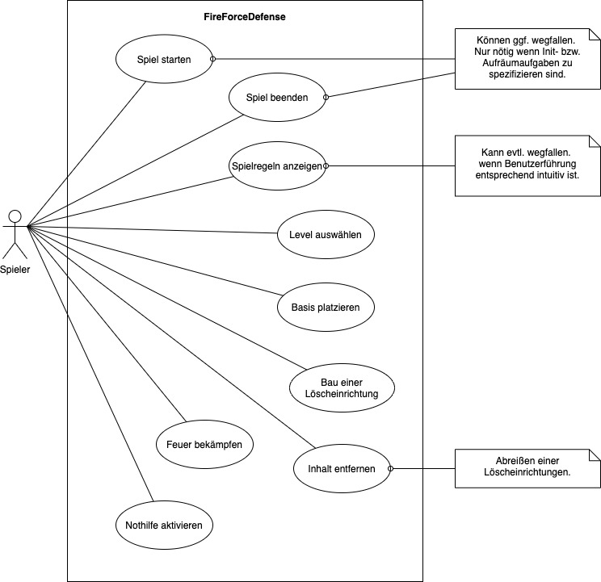

Use Cases
=================================

Use Case 1: Level auswählen
=================================
**Kennung**: UC-1

**Kurzbeschreibung**: Der Spieler wählt auf der Level-Karte ein Level aus. Das Spielfeld öffnet sich.

**Vorbedingung**: Es existiert mindestens ein freigeschaltetes Level.

**Nachbedingung**: Falls die Vorbedingung erfüllt ist, 
                   befindet sich der Spieler nach Auswahl des Levels auf dem Spielfeld des gewählten Levels.

Normaler Ablauf:
----------------------
| Spieler Aktion | System Reaktion |
|:--------------|:----------------|
| 1. Der Anwendungsfall beginnt, wenn der Spieler die Karte der verfügbaren Level öffnet. | 2. Das System zeigt dem Spieler die Level-Karte.
| 3. Der Spieler wählt ein Level aus. | 4. Das System prüft, ob das Level freigeschaltet ist. |
| 5. Der Anwendungsfall endet, wenn das gewählte Level freigeschaltet ist und sich der Spieler auf dem Spielfeld des Levels befindet. ||

Ablauf-Varianten:
-----------
4a. Level ist nicht freigeschaltet.

1. Das System weist den Spieler daraufhin, dass das gewählte Level nicht spielbar ist, weil es noch nicht freigeschaltet ist.
2. Der Spieler wählt ein anderes Level auf der Level-Karte aus.
3. Weiter bei 5, wenn neu gewähltes Level freigeschaltet ist ansonsten weiter bei 4a.

Use Case 2: Basis platzieren
=================================
**Kennung**: UC-2

**Kurzbeschreibung**: Der Spieler platziert die Basis auf einer freien, hexagonalen Zelle des Spielfeldes.

**Vorbedingung**: Auf dem Spielfeld ist mindestens eine freie, hexagonale Zelle vorhanden.

**Nachbedingung**: Falls die Vorbedingung erfüllt ist, 
                   wird die Basis in der vom Spieler gewünschten hexagonalen Zelle platziert.

Normaler Ablauf:
----------------------
| Spieler Aktion | System Reaktion |
|:--------------|:----------------|
| 1. Der Anwendungsfall beginnt, wenn der Spieler die Basis auf einer hexagonalen Zelle des Spielfeldes platzieren möchte. | 2. Das System zeigt an in welchen Zellen des Spielfeldes die Basis platziert werden kann.
| 3. Der Spieler platziert die Basis. | 4. Das System prüft, ob die Basis in einem gültigen Zelle platziert wurde. |
| 5. Der Anwendungsfall endet, wenn die Basis auf einer gültigen Zelle platziert wurde. ||

Ablauf-Varianten:
-----------
4a. Basis wurde in ungültiger Zelle platziert.

1. Das System informiert den Spieler über die ungültige Platzierung und fordert den Spieler dazu auf, die Basis in einer anderen Zelle zu platzieren.
2. Der Spieler platziert die Basis in einer anderen Zelle.
3. Weiter bei 5, wenn die neue Platzierung in einer gültigen Zelle ist. Ansonsten weiter bei 4a. 

Use Case 3: Bau einer Löscheinrichtung
=================================
**Kennung**: UC-3

**Kurzbeschreibung**: Der Spieler baut eine Löscheinrichtung auf einer freien, hexagonalen Zelle des Spielfeldes. Der Bau einer Löscheinrichtung kostet In-Game Währung.

**Vorbedingung(en)**: Auf dem Spielfeld ist mindestens eine freie, hexagonale Zelle vorhanden. Es ist ausreichend viel In-Game Währung zum Bau einer Löscheinrichtung vorhanden.

**Nachbedingung(en)**: Falls die Vorbedingungen erfüllt sind, 
                       wird die Löscheinrichtung in der vom Spieler gewünschten hexagonalen Zelle platziert.

Normaler Ablauf:
----------------------
| Spieler Aktion | System Reaktion |
|:--------------|:----------------|
| 1. Der Anwendungsfall beginnt, wenn der Spieler die Löscheinrichtung auf einer hexagonalen Zelle des Spielfeldes platzieren möchte. | 2. Das System prüft, ob der Spieler genügend In-Game Währung zum Bau der Löscheinrichtung vorhanden ist.
| | 3. Das System zeigt an in welchen Zellen des Spielfeldes die Löscheinrichtung platziert werden kann. 
| 4. Der Spieler platziert die Löscheinrichtung. | 5. Das System prüft, ob die Löscheinrichtung in einer gültigen Zelle platziert wurde.|
| 6. Der Anwendungsfall endet, wenn die Löscheinrichtung auf einer gültigen Zelle platziert wurde. ||

Ablauf-Varianten:
-----------
2a. Nicht genügend In-Game Währung vorhanden.

1. Das System ignoriert den Bau der Löscheinrichtung.
2. Der Anwendungsfall endet.

5a. Löscheinrichtung wurde in ungültiger Zelle platziert.

1. Das System informiert den Spieler über die ungültige Platzierung und fordert den Spieler dazu auf, die Löscheinrichtung in einer anderen Zelle zu platzieren.
2. Der Spieler platziert die Löscheinrichtung in einer anderen Zelle.
3. Weiter bei 5, wenn die neue Platzierung in einer gültigen Zelle ist. Ansonsten weiter bei 5a. 

Use Case 4: Inhalt entfernen
=================================
**Kennung**: UC-4

**Kurzbeschreibung**: Der Spieler kann Löscheinrichtungen nach der Errichtung wieder entfernen und erhält die Hälfte der für die Errichtung ausgegebenen In-Game Währung auf seinen Account gutgeschrieben.

**Vorbedingung**: Auf dem Spielfeld ist mindestens eine Zelle mit - vom Spieler - entfernbarem Inhalt vorhanden.

**Nachbedingung**: Falls die Vorbedingung erfüllt ist, wird der Inhalt aus der hexagonalen Zelle entfernt.

Normaler Ablauf:
----------------------
| Spieler Aktion | System Reaktion |
|:--------------|:----------------|
| 1. Der Anwendungsfall beginnt, wenn der Spieler eine Löscheinrichtung vom Spielfeld entfernen möchte. | 2. Das System prüft, ob die Löscheinrichtung inaktiv und entfernbar ist.
| | 3. Das System entfernt die ausgewählte Löscheinrichtung aus der Zelle.
| 5. Der Anwendungsfall endet, wenn die Löscheinrichtung aus der Zelle entfernt wurde. | |

Ablauf-Varianten:
-----------
2a. Löscheinrichtung ist aktiv.

1. Das System informiert den Spieler, dass die Löscheinrichtung nicht entfernt werden kann.
2. Der Anwendungsfall endet.

Use Case 5: Feuer bekämpfen
=================================
**Kennung**: UC-5

**Kurzbeschreibung**: Das Feuer kann vom Spieler durch die erbauten Löscheinrichtungen bekämpfen. 
Das Feuer gilt als bekämpft, wenn durch die Bekämpfung die Lebensanzahl der Flamme auf 0 sinkt.
Das Feuer gilt als abgeschwächt, wenn sich durch die Bekämpfung die Lebensanzahl der Flamme nur verringert, allerdings größer als 0 ist.

**Vorbedingung**: --

**Nachbedingung**: Das Feuer wird in einer hexagonalen Zelle bekämpft.

Normaler Ablauf:
----------------------
| Spieler Aktion | System Reaktion |
|:--------------|:----------------|
| 1. Der Anwendungsfall beginnt, wenn der Spieler ein Feuer in einer hexagonalen Zelle des Spielfeldes bekämpfen möchte. | 2. Das System prüft ob sich Feuer in der Nähe der Löscheinrichtung befindet.
| | 3. Die aktive Löscheinrichtung versucht das Feuer zu bekämpfen.
| 5. Der Anwendungsfall endet, wenn das Feuer in der hexagonalen Zelle bekämpft wurde. ||

Ablauf-Varianten:
-----------
2a. Kein Feuer in der Nähe der Löscheinrichtung.

1. Das System schaltet die Löscheinrichtung inaktiv.
2. Weiter bei 2. im normalen Ablauf.

Use Case 6: Nothilfe aktivieren
=================================
**Kennung**: UC-6

**Kurzbeschreibung**: Der Spieler kann einmal pro Level eine Nothilfe aktivieren. Nothilfe ist ein Regen, der das Feuer in allen Zellen abschwächt.

**Vorbedingung(en)**: Eine aktivierbare Nothilfe ist vorhanden. 

**Nachbedingung(en)**: Falls die Vorbedingung erfüllt ist, wird die Nothilfe aktiviert.

Normaler Ablauf:
----------------------
| Spieler Aktion | System Reaktion |
|:--------------|:----------------|
| 1. Der Anwendungsfall beginnt, wenn der Spieler die Nothilfe aktivieren möchte. | 2. Das System prüft ob eine aktivierbare Nothilfe vorhanden ist.
| | 3. Das System aktiviert die Nothilfe.
| 5. Der Anwendungsfall endet, wenn die Nothilfe erfolgreich aktiviert wurde. | |

Ablauf-Varianten:
-----------
2a. Eine aktivierbare Nothilfe ist nicht vorhanden.

1. Das System informiert den Spieler, dass die Nothilfe nicht aktiviert werden kann.
2. Der Anwendungsfall endet.